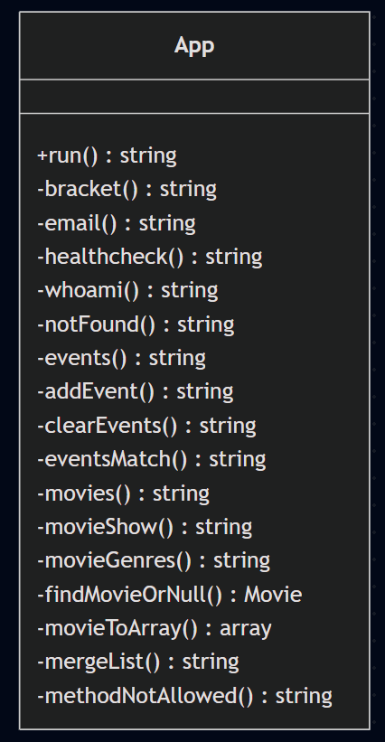
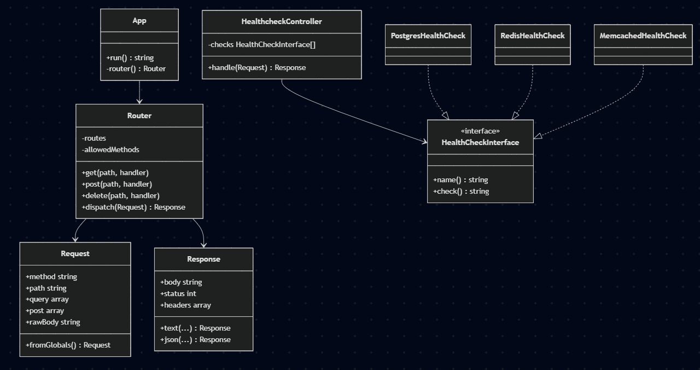

## Статус

Рефакторинг доведён до конца **только для одного эндпоинта — `/healthcheck`**. Остальные 9 маршрутов
(`/bracket`, `/checkemail`, `/whoami`, `/mergelist`, `/events` POST/DELETE, `/events/match`, `/movies`,
`/movies/show`, `/movies/genres`) из `App` убраны, но в контроллеры ещё не перенесены — они помечены как
TODO прямо в `App::router()`:

```php
private function router(): Router
{
    $router = new Router();

    $router->get('/healthcheck', fn (Request $r) => (new HealthcheckController([
        new PostgresHealthCheck(),
        new RedisHealthCheck(),
        new MemcachedHealthCheck(),
    ]))->handle($r));

    // TODO реализовать остальные методы:
    // /bracket - post
    // /checkemail - post
    // /whoami - get
    // /mergelist - post
    // /events - post
    // /events - delete
    // /events/match - get
    // /movies - get
    // /movies/show - get
    // /movies/genres - get

    return $router;
}
```

**эти 9 маршрутов сейчас отвечают 404**, потому что для них нет записей в `Router`. Домен-классы
`BracketValidator`, `EmailValidator`, `ListMerger`, `Cinema\MovieMapper`, `Events\RedisEventRepository` и т.д.
никуда не делись и рабочие, но с HTTP-слоем больше не связаны — код, ожидающий переноса.

Ниже — что уже сделано (с кодом «до/после», это применимо к `/healthcheck` уже сейчас), и что нужно повторить
по тому же образцу для остальных эндпоинтов.

## Что уже реализовано: `/healthcheck`

### До

Исходный `App.php` — один класс, отвечающий одновременно за:
- роутинг
- HTTP
- бизнес-логику
- сериализацию ответов в JSON/текст.

```php
class App
{
    public function run(): string
    {
        Session::start();
        $path = parse_url($_SERVER['REQUEST_URI'] ?? '/', PHP_URL_PATH);

        return match ($path) {
            '/bracket' => $this->bracket(),
            '/checkemail' => $this->email(),
            '/whoami' => $this->whoami(),
            '/healthcheck' => $this->healthcheck(),
            '/mergelist' => $this->mergeList(),
            '/events' => $this->events(),
            '/events/match' => $this->eventsMatch(),
            '/movies' => $this->movies(),
            '/movies/show' => $this->movieShow(),
            '/movies/genres' => $this->movieGenres(),
            default => $this->notFound(),
        };
    }

    private function bracket(): string { /* ... */ }
    private function email(): string { /* ... */ }
    private function healthcheck(): string
    {
        try {
            $pdo = new PDO(
                sprintf('pgsql:host=%s;dbname=%s', getenv('PG_HOST'), getenv('PG_DB')),
                getenv('PG_USER'),
                getenv('PG_PASSWORD')
            );
            $checks['postgres'] = 'OK';
        } catch (Throwable $e) {
            $checks['postgres'] = 'ERROR: ' . $e->getMessage();
        }
        // аналогично вручную — Redis, Memcached
        header('Content-Type: application/json');
        return json_encode($checks, JSON_PRETTY_PRINT);
    }
    private function movies(): string { /**/ }
    private function movieShow(): string { /**/ }
    private function movieGenres(): string { /**/ }
}
```

У класса нет единственной причины для изменения. Например, изменение формата ответа для `/movies` требует изменить тот же файл, что и логику валидации e-mail — нарушения Single Responsibility.

### После

`App` — теперь связывает маршруты с контроллерами а также ничего не знает про конкретную бизнес-логику:

```php
class App
{
    public function run(): string
    {
        Session::start();

        $request = Request::fromGlobals();
        $response = $this->router()->dispatch($request);

        http_response_code($response->status);
        foreach ($response->headers as $name => $value) {
            header("{$name}: {$value}");
        }

        return $response->body;
    }

    private function router(): Router
    {
        $router = new Router();
        $router->get('/healthcheck', fn (Request $r) => (new HealthcheckController([
            new PostgresHealthCheck(),
            new RedisHealthCheck(),
            new MemcachedHealthCheck(),
        ]))->handle($r));
        // TODO: остальные маршруты
        return $router;
    }
}
```

### До
`App::healthcheck()` вручную собирал DSN и подключения.
Например, добавить проверку Elasticsearch означало бы вписать ещё один `try/catch` внутрь того же метода.

### После

Каждая проверка — реализация `Health\HealthCheckInterface`, `HealthcheckController` зависит только от абстракции и списка проверок, полученного через конструктор:

```php
interface HealthCheckInterface
{
    public function name(): string;
    public function check(): string;
}

final class PostgresHealthCheck implements HealthCheckInterface
{
    public function name(): string { return 'postgres'; }

    public function check(): string
    {
        try {
            PdoFactory::createFromEnv();
            return 'OK';
        } catch (\Throwable $e) {
            return 'ERROR: ' . $e->getMessage();
        }
    }
}

final class HealthcheckController
{
    public function __construct(private readonly array $checks) {}

    public function handle(Request $request): Response
    {
        $result = [];
        foreach ($this->checks as $check) {
            $result[$check->name()] = $check->check();
        }
        return Response::json($result, 200, JSON_PRETTY_PRINT);
    }
}
```

Также добавлена `Cache\MemcachedClientFactory` — раньше только Postgres и Redis имели фабрики, а Memcached-подключение собиралось вручную.


# До

Каждый обработчик сам проверял `$_SERVER['REQUEST_METHOD']` и вручную формировал 405-ответ — почти одинаковый код в разных методах.

```php
private function bracket(): string
{
    if ($_SERVER['REQUEST_METHOD'] !== 'POST') {
        http_response_code(405);
        return "Method Not Allowed. Необходим POST / с параметром 'string'.\n";
    }
    // ...
}
```

Чтобы добавить новый маршрут, нужно было редактировать `match()` в `run()` .

# После
Проверка метода вынесена один раз в `Http\Router`: маршрут регистрируется с конкретным HTTP-методом (`$router->post(...)`, `$router->get(...)`, `$router->delete(...)`), а несовпадение метода обрабатывается в одной точке:

```php
final class Router
{
    public function dispatch(Request $request): Response
    {
        $handler = $this->routes[$request->method . ' ' . $request->path] ?? null;
        if ($handler !== null) {
            return $handler($request);
        }

        $allowed = $this->allowedMethods[$request->path] ?? null;
        if ($allowed === null) {
            return Response::text("Not Found\n", 404);
        }

        return Response::text('Method Not Allowed. Допустимо: ' . implode(', ', $allowed) . ".\n", 405);
    }
}
```

Пока эти контроллеры не написаны — `Router` не знает про `/bracket`, `/checkemail` и т.д. и вернёт для них
`404 Not Found` (а не `405`, как было бы после регистрации маршрута с ограничением по методу).

# До

`header()` и `http_response_code()` вызывались прямо внутри методов, отвечающих за бизнес-логику.

# После
Побочные эффекты изолированы в `Http\Response` (Value Object) и единственной точке — `App::run()`.
Контроллеры возвращают `Response`.

# UML

## До




## После



